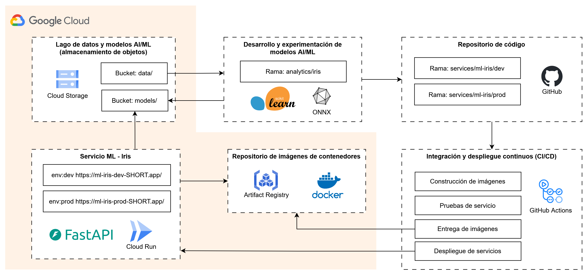

# Proyecto MLOps - Icesi 2025-1

Diseño, desarrollo y despliegue de servicios de AI/ML con flujos MLOps, así como una aplicación web frontend para mostrar su interacción desde una interfaz gráfica.

**Estudiantes:**
- Jean Pierre Londoño
- Héctor Torres

**Contenido:**
- [Despliegue](#despliegue)
    - [Despliegue en Google Cloud con GitHub Actions](#despliegue-en-google-cloud-con-github-actions)
- [Diseño general](#diseño-general)
- [Diseño GitOps + MLOps](#diseño-gitops-mlops)
    - [Infraestructura con Terraform](#infraestructura-con-terraform)
    - [CI/CD con GitHub Actions](#cicd-con-github-actions)

**Servicios en Google Cloud:**

| Servicio  | Directorio | Ambiente | URL | Estado |
|-----------|------------|----------|-----|--------|
| **ml-iris** | [services/ml-iris](./services/ml-iris) | | | |
|  | | dev | [ml-iris-dev](https://ml-iris-dev-858385072313.us-central1.run.app) |  |
|  | | prod | [ml-iris-prod](https://ml-iris-prod-858385072313.us-central1.run.app) |  |
| **ml-mnist** | [services/ml-mnist](./services/ml-mnist) | | | |
|  | | dev | [ml-mnist-dev](https://ml-mnist-dev-858385072313.us-central1.run.app) |  |
|  | | prod | [ml-mnist-prod](https://ml-mnist-prod-858385072313.us-central1.run.app) |  |

**Aplicación web en Google Cloud:**


| Nombre       | Directorio | URL | Estado |
|--------------|------------|-----|--------|
| **app-st**   | [webapps/app-st](./webapps/app-st) | https://app-st-858385072313.us-central1.run.app | 


# Despliegue

## Despliegue en Google Cloud con GitHub Actions

**Requerimientos:**
- Proyecto de Google Cloud con facturación habilitada.
- Herramientas de línea de comandos:
    - `gcloud`: https://cloud.google.com/sdk/docs/install
    - `gh`: https://cli.github.com/
    - `jq`: https://jqlang.org/download/
    - `terraform`: https://developer.hashicorp.com/terraform/install

**Pasos:**

1. Configurar proyecto y autenticación de Google Cloud:
    ```sh
    # Opción 1: si está utilizando Cloud Shell ya está se tiene definido el proyecto actual y está autenticado

    # Opción 2: si está utilizando otra terminal
    gcloud config set project PROJECT_ID
    gcloud auth login
    gcloud auth application-default login
    ```

2. Configurar autenticación de GitHub CLI:
    ```sh
    # Opción 1
    gh auth login -h github.com

    # Opción 2
    gh auth login -h github.com -p ssh -w
    ```

3. Configurar y provisionar recursos en la nube de Google Cloud, y actualizar variables de GitHub Actions:
    ```sh
    bash manage-cloud.sh setup-provision
    ```
    
    Verificar las variables de repositorio definidas:
    - CLI: `gh variable list`
    - Web: https://github.com/jepilogo97/final-project-mlops/settings/variables/actions

    Nota: las siguientes variables se definen en [terraform.tfvars.json](infrastructure/gcp/terraform/terraform.tfvars.json) y pueden modificarse conforme a necesidad:
    ```json
    {
        "github_user_name": "jepilogo97",
        "github_repository_name": "final-project-mlops",
        "region": "us-central1"
    }
    ```

4. Construir y desplegar modelos y servicios:
    ```sh
    bash manage-cloud.sh build-deploy
    ```

    Verificar despliegues en Cloud Run: https://console.cloud.google.com/run


# Diseño general

Los servicios AI/ML corresponden a HTTP RESTful APIs desarrollados con FastAPI y ONNX como formato estándar. 

La interfaz gráfica web frontend consiste en una aplicación Streamlit.

La mejor práctica es separar en diferentes repositorios los componentes del sistema: el desarrollo de modelos, la configuración y provisionamiento de infraestructura, y el desarrollo de servicios y aplicaciones. Sin embargo, para efectos del presente proyecto se presentan estos componentes del sistema en un mismo repositorio, separados por ramas y directorios, de tal manera que se tienen las siguientes estructura de directorios y ramas del repositorio:

## Estructura de directorios

```
.github/
    config/
    worflows/

analytics/          # modelos desarrollados que simulan un equipo de analítica o ciencia de datos
    iris/           # desarrollo de modelo ONNX para clasificación de dataset IRIS

infrastructure/
    gcp/            # configuración y provisionamiento de un proyecto de Google Cloud
        scripts/    # scripts para configuración de un proyecto de Google Cloud
        terraform/  # manifiestos de de Terraform para provisionamiento de recursos

services/           # servicios del sistema
    ml-iris/        # servicio RESTful API para modelo IRIS
    ml-mnist/        # servicio RESTful API para modelo IRIS

webapps/
    app-st/         # servicio de aplicación web frontend desarrollada con Streamlit
```

## Ramas del repositorio
* `main`: consolidado de las ramas de producción (en su defecto, la única rama del componente del sistema correspondiente)
* `analytics/iris`: desarrollo de modelo ONNX a partir del dataset IRIS; contiene el código de construcción del modelo
* `analytics/mnist`: desarrollo de modelo ONNX a partir del dataset MNIST; contiene el código de construcción del modelo
* `analytics-base`
* `infrastructure/gcp`: configuración y provisionamiento de Terraform
* `services/ml-iris/dev`: desarrollo del servicio RESTful API para modelo IRIS; contiene el código de construcción del servicio para el ambiente dev
* `services/ml-iris/prod`: desarrollo del servicio RESTful API para modelo IRIS; contiene el código de construcción del servicio para el ambiente prod
* `services-base`
* `webapps/app-st`: aplicación web Streamlit para interactuar con los servicios ML deplegados
* `webapps-base`


# Diseño MLOps

El diseño MLOps de los servicios ML tienen el siguiente diagrama tipo ejemplificado con el servicio `ml-iris`:



## Infraestructura con Terraform

Se emplean los manifiestos de Terraform en [infrastructure/gcp/terraform](./infrastructure/gcp/terraform) para provisionamiento de recursos en Google Cloud.

Nota: el estado de Terraform es guardado en el bucket `TF_STATES_BUCKET_NAME=tfstates-${PROJECT_ID}` definido en [setup.sh](./infrastructure/gcp/terraform/setup.sh) y [provision.sh](./infrastructure/gcp/terraform/provision.sh)


## CI/CD con GitHub Actions

**Autorización:**

La autorización en Google Cloud de los GitHub Actions Workflows se hace a través Workload Identity Federation, por lo que no es necesario definir secretos en GitHub con llaves de cuentas de servicio de Google Cloud.
- Provisionamiento: [infrastructure/gcp/terraform/iam.workload_identity.github_actions.tf](./infrastructure/gcp/terraform/iam.workload_identity.github_actions.tf)
- Referencia: https://cloud.google.com/iam/docs/workload-identity-federation

Sin embargo, considerando que se buscó entregar un único repositorio de GitHub, los GitHub Actions Workflows se limitaron a la construcción de artefactos, ejecución de pruebas, y entrega de artefactos (Continuous Delivery). El despliegue continuo se implementó a través de Google Cloud Build.
